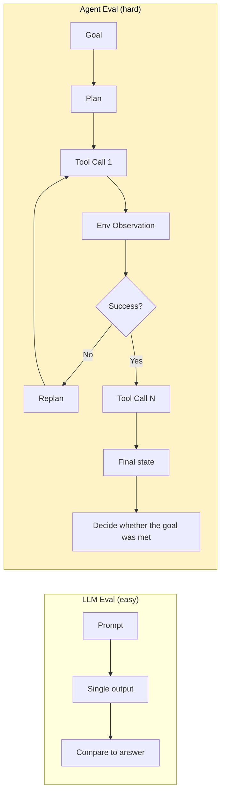
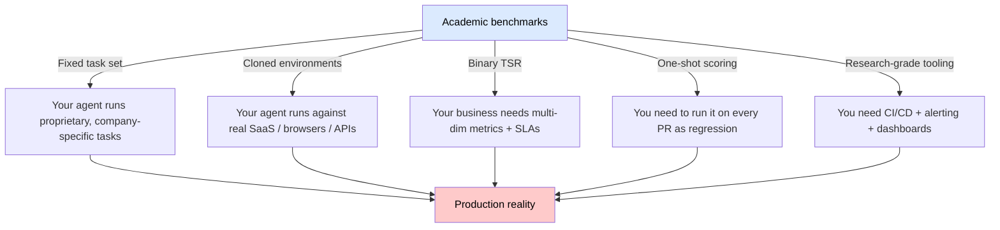
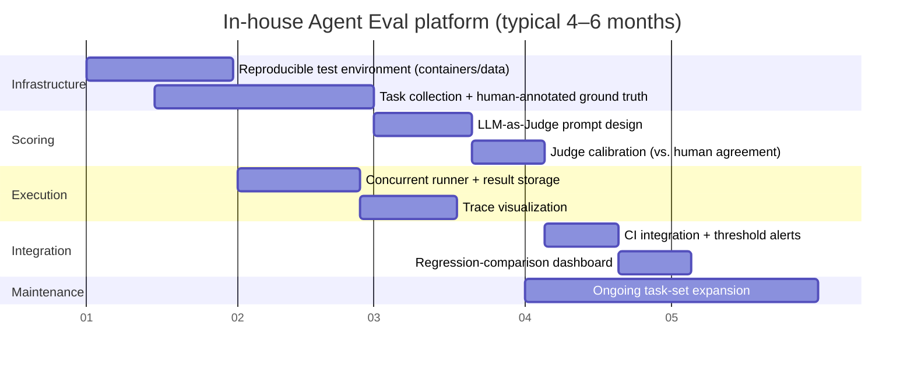
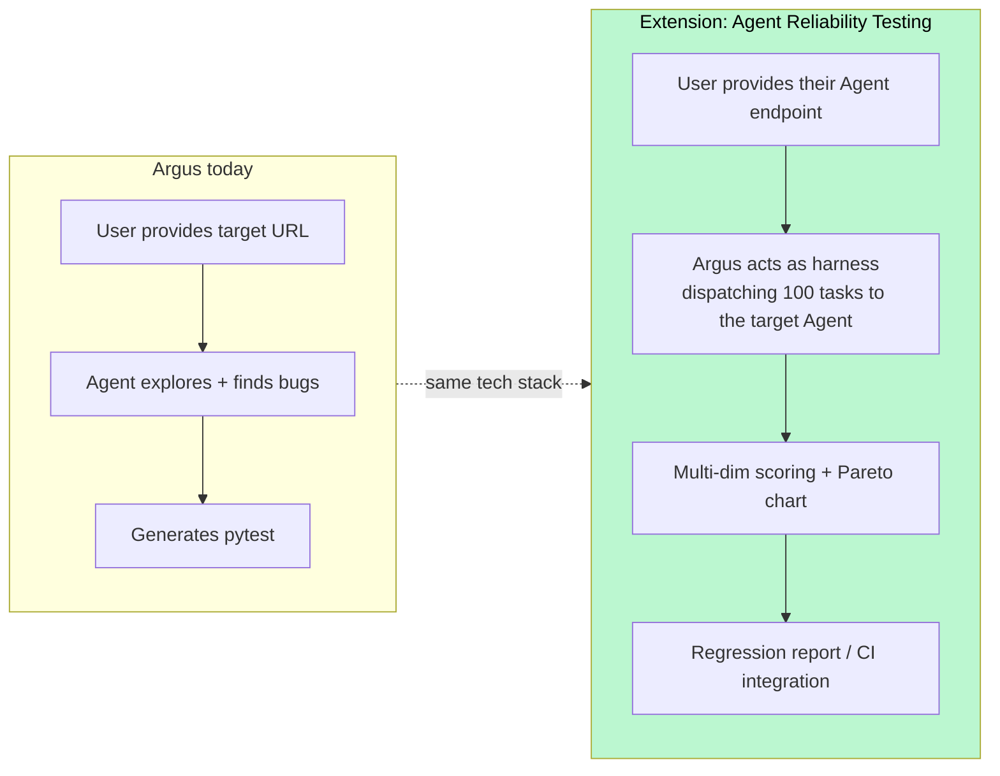

# Agent Evaluation Deep Dive

> Why "Agent Evaluation" is the **#1 most acute gap** in the LLM / Agent testing space today, and how Argus can step into it.

This article expands on the R1 node in §9 of [llm-agent-testing-overview.md](./llm-agent-testing-overview.md).

---

## 1. First, What Is Agent Evaluation?

Traditional LLM Eval asks **"did the model answer correctly?"**: give a prompt, look at a single output.
Agent Eval asks **"did the Agent get it done?"**: give a goal, and the Agent has to plan → call tools → observe → recover → finish, possibly across 20+ steps.

The difference is not quantitative, it is qualitative:



The evaluation surface is more than "right vs. wrong"; there are at least **6 mutually-tensioned metrics**:

| Dimension | Description | Example in Argus |
|---|---|---|
| **Task Success Rate (TSR)** | Whether the final goal was achieved (binary) | Did the Agent find the login bug on the target page? |
| **Step Accuracy** | Whether each individual decision was reasonable | Clicked the right button, not a random one |
| **Tool-Call Accuracy** | Right tool selected with correct arguments | `click(selector="#login")` vs `click(selector=".btn")` |
| **Efficiency** | Steps / tokens / wall-clock time | 5 steps vs. 50 steps to the same outcome |
| **Recovery** | Can the agent self-heal after errors? | Dismissing a popup that blocks the target button |
| **Robustness** | Stability across repeated runs of the same task | Variance in bug-find rate over 10 runs |

**Key trap**: high TSR ≠ good Agent. One agent might hit TSR=80% but average 40 steps and \$5/task — commercially unviable. Another at TSR=75%, 5 steps, \$0.3/task is the actual winner. So Agent Eval has to be a **multi-dimensional Pareto curve**, not a single score.

---

## 2. Why It's the #1 Gap

### 2.1 Plenty of Academic Benchmarks, but Not Usable in Practice

Quite a few public agent benchmarks already exist:

| Benchmark | Setting | # Tasks | SOTA (2025) |
|---|---|---|---|
| **WebArena** | Simulated Reddit/GitLab/e-commerce sites | 812 | GPT-4 ≈ 14%, Claude 3.5 ≈ 36% |
| **VisualWebArena** | WebArena + visual tasks | 910 | Top ≈ 25% |
| **SWE-Bench** | GitHub issue fixes | 2294 | Claude 3.5 Sonnet ≈ 49% |
| **AgentBench** | 8 environments (OS/DB/Web/…) | 1091 | GPT-4 ≈ 42 |
| **OSWorld** | Real desktop interaction | 369 | Top ≈ 12% |
| **GAIA** | General assistant (Meta) | 466 | Top ≈ 39% |
| **τ-bench** | Tool-use in customer support | 200 | Top ≈ 50% |
| **MLE-Bench** | ML tasks (OpenAI) | 75 | Top ≈ 17% |

These benchmarks are great for **researchers** (publishing papers, cross-comparing models) but nearly useless for **product teams**, because:



**In one line**: academic benchmarks tell you "is Claude or GPT stronger", not **"did your Agent regress today?"**.

### 2.2 Production-Grade Frameworks Are Essentially Missing

What's actually usable today:

| Tool | What it does | Gap to true Agent Eval |
|---|---|---|
| **Langfuse / LangSmith** | Tracing / cost monitoring | Records "what happened", does not judge "was it good" |
| **Promptfoo / DeepEval** | Prompt / RAG eval | Single-turn focus, multi-turn agents barely covered |
| **Braintrust / Humanloop** | Enterprise eval platforms | Tilted toward LLM-output eval; agent workflows are DIY |
| **smithery.ai agentic-eval** | MCP agent eval | Too new, small ecosystem |
| **LangGraph Studio** | Agent debugging | An IDE, not a CI |

**Conclusion**: there is no "plug-and-play, multi-dimensional, CI-integrated, custom-environment-friendly" Agent Eval platform.

---

## 3. Why In-House Builds Take 3–6 Months on Average

I've broken down a typical in-house build path, and every block is a trap:



### 3.1 The Seven Hard Problems (Any One Can Stall a Team)

1. **Reproducible environments** — Agents running on real websites face A/B tests, ads, time-sensitive data. You either freeze the environment (record/replay, Docker snapshots) or tolerate nondeterminism. Meta dedicates an entire team to this.

2. **Defining ground truth** — what does "task complete" actually mean?
   - **Strict mode**: exact final-state match (e.g. this specific order appears in the DB)
   - **Loose mode**: an LLM-Judge inspects the trajectory and says "looks done"
   - The former can't cover open-ended tasks; the latter is untrustworthy. Most teams end up doing both → 2× engineering effort.

3. **Judge-model calibration** — LLM-as-Judge has its own biases (favoring longer answers, GPT's own style). You need 500–1000 human-labeled samples for calibration, with Cohen's Kappa ≥ 0.7 before it's usable. Most teams skip this and discover post-launch that the Judge and real users disagree completely.

4. **Annotating multi-step traces** — for a 50-step task, do you label every step? Labeling everything explodes cost; labeling nothing leaves you flying blind during debugging. A common compromise is **checkpoint annotation** (label key milestones).

5. **Concurrency and cost blowups** — 1000 tasks × 3 retries × 100k tokens ≈ \$300 per full run. Running it on every PR can cost tens of thousands a month. Smart sampling (MMR, impact analysis) becomes mandatory.

6. **Statistical inference under nondeterminism** — the same agent on the same task produces different results twice. How many runs prove "new is better than old" with significance? That's bandit / bootstrap territory, unfamiliar to 90% of engineers.

7. **Task-set staleness** — when product features change, the eval set must change too. Without a dedicated owner, the eval set drifts from reality, nobody trusts the results, and the platform dies.

### 3.2 Why Reuse Is Hard

Company A's agent does customer-support dialog; company B's does ops-script generation; company C (Argus) does Web UI automation exploration. The three have completely different **environments, tool schemas, and success criteria** — so open-sourcing an "eval framework" is feasible, but the **eval datasets and judges** are barely reusable.

That's why Langfuse can scale (tracing is universal) but Braintrust grows more slowly (eval sits too close to the business).

---

## 4. What This Gap Means for Argus

Argus's business happens to be **"using an Agent to test other people's Web UIs"**. Flipped around:

> **What you do every day is, in essence, Agent Evaluation itself — only the subject under test is a website, not an agent.**

If we abstract the ClientWebUIAgent's testing capability up one level, we get an entirely new product line:



### Three Actions You Can Start Today

1. **Export `ClientWebUIAgent` execution traces in a structured form** — add a `trace.jsonl` output with step / action / observation / tokens / latency. This is the shared data model behind every Agent Eval product.

2. **Define a "success-criteria DSL"** — let users write the "task completion" judgment in YAML:
   ```yaml
   task: "After login the username should be visible"
   success_when:
     - dom_contains: "Welcome, ${username}"
     - url_matches: "/dashboard"
   max_steps: 20
   max_cost_usd: 0.5
   ```

3. **Dogfood it first** — every time the orchestrator prompt changes, run 50 "known-bug test sites" and check whether the bug-find rate has regressed. Get this internal eval loop solid, then open it externally.

---

## 5. One-Line Summary

> **Agent Eval is the LLM-era fusion of unit tests + integration tests + load tests, and there is still no de facto standard at the level of pytest — whoever ships the "pytest of Agents" first is the next billion-dollar company.**

---

## Appendix A: References and Resources

- **WebArena**: https://webarena.dev/
- **SWE-Bench**: https://www.swebench.com/
- **AgentBench (THU)**: https://github.com/THUDM/AgentBench
- **OSWorld**: https://os-world.github.io/
- **GAIA (Meta)**: https://huggingface.co/gaia-benchmark
- **τ-bench (Sierra)**: https://github.com/sierra-research/tau-bench
- **MLE-Bench (OpenAI)**: https://openai.com/index/mle-bench/
- **OWASP LLM Top 10**: https://owasp.org/www-project-top-10-for-large-language-model-applications/

## Appendix B: Recommended Further Reading

- Anthropic: *Building Effective Agents* (2024)
- Sierra: *τ-bench Paper — A Benchmark for Tool-Agent-User Interaction in Real-World Domains*
- Princeton: *SWE-Bench Verified: Adjusting Agent Benchmark for Realism*
- OpenAI: *A Research Preview of MLE-Bench*
