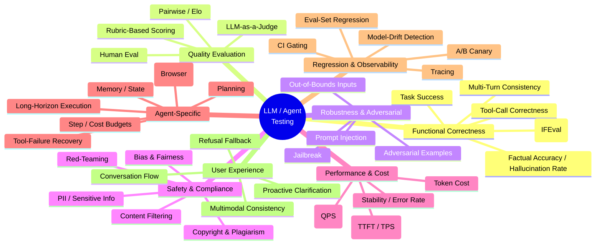
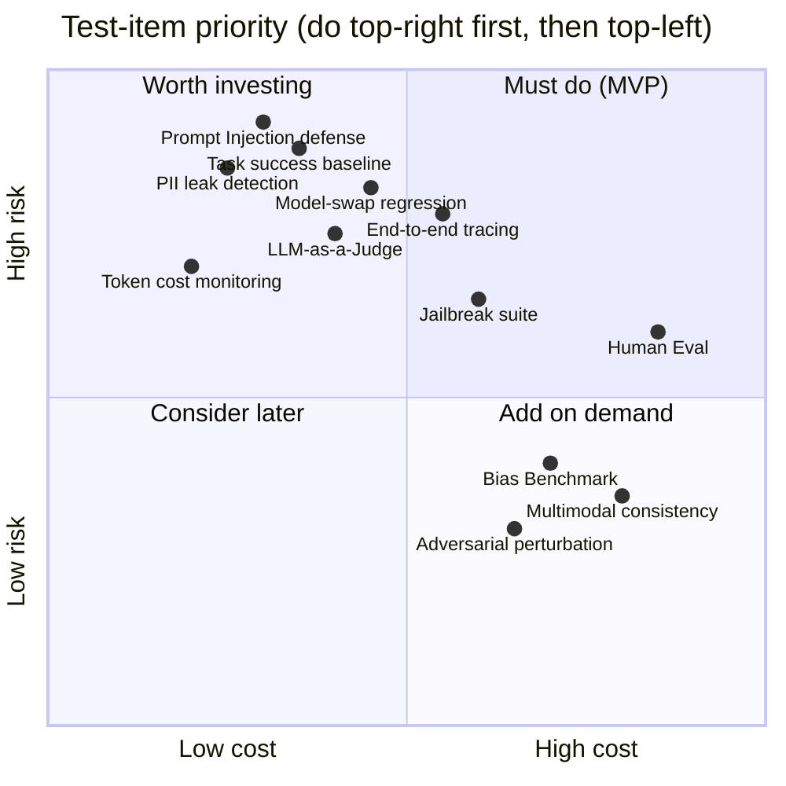
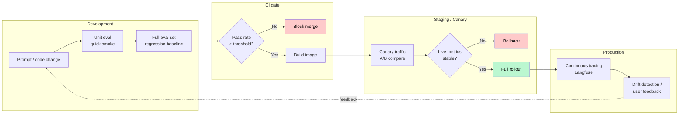
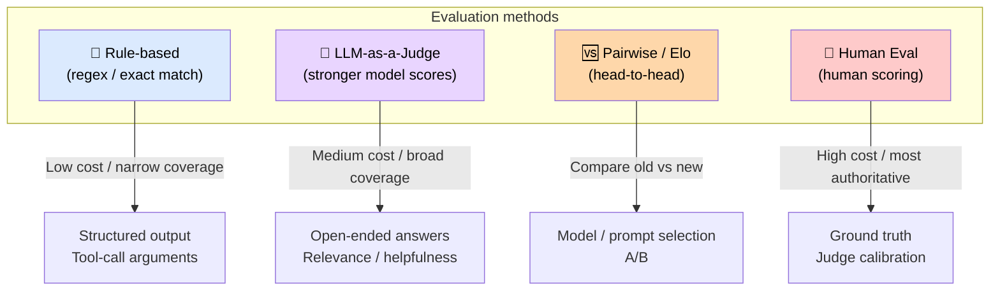
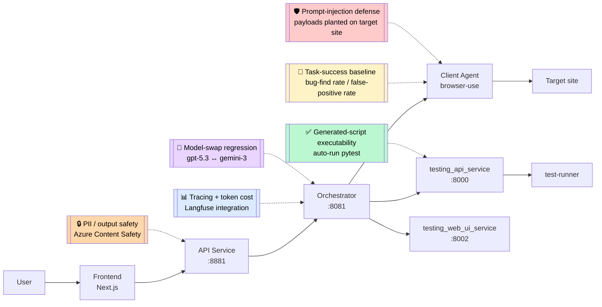
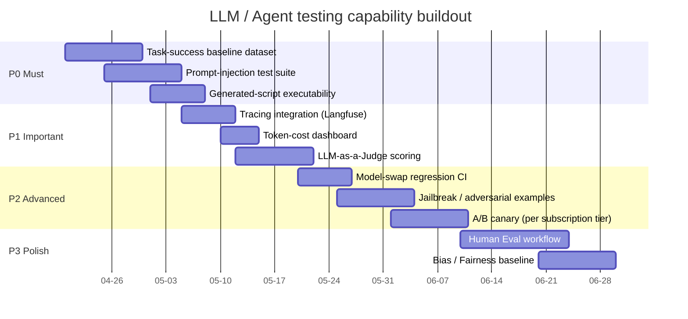
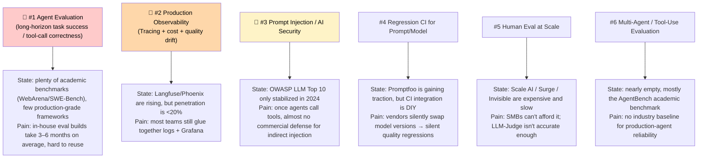

# LLM / AI Agent / Chatbot Testing Overview

This document offers a visual summary of the testing landscape for LLM, AI Agent, and Chatbot products, mapped to concrete Argus scenarios.

> Rendering note: this document uses Mermaid diagrams. GitHub, VS Code (Markdown Preview Mermaid), Obsidian, and Typora render them out of the box.

---

## 1. Big-Picture Mind Map (8 Testing Dimensions)

---

## 2. Priority Matrix (Launch Risk × Implementation Cost)

---

## 3. Where Testing Lives in the Dev Lifecycle (Shift-Left → Shift-Right)

---

## 4. Four Evaluation Methods Compared

---

## 5. Mapped to the Argus Architecture

---

## 6. Argus Roadmap (Suggested Order)

---

## 7. Toolchain Quick-Reference

| Category | Recommended Tools | When to Use |
|---|---|---|
| Eval framework | **Promptfoo** / DeepEval / OpenAI Evals | Regression in CI |
| RAG-specific | **Ragas** | Retrieval-augmented scenarios (document QA) |
| Benchmark datasets | **WebArena** / AgentBench / MT-Bench | Compare against academic / public baselines |
| Red-Team | **Garak** / PyRIT / Giskard | Jailbreak and prompt-injection scanning |
| Observability | **Langfuse** / Arize Phoenix | Production tracing: cost / latency / quality |
| Guardrails | **LlamaGuard** / NeMo Guardrails | Input / output content filtering |
| Agent eval | **smithery.ai/agentic-eval** / supercent skill | Task-level agent evaluation |

---

## 8. The One-Page Mantra

> **"Functionally accurate, quality measurable, adversary-resistant, safe and compliant, performance testable, agent plans well, regression gated, experience smooth."**

Eight phrases, eight dimensions — a pre-launch self-check across them covers about 90% of the testing risk for an LLM product.

---

## 9. The Most Urgent Market Needs (Ranked by Urgency)

**The two biggest gaps:**

- **Agent-level (not LLM-level) eval standards** — the LLM layer has MMLU/HELM; the agent layer has no commonly accepted benchmark.
- **Security testing where the subject is an Agent** — existing tools assume the subject is a "chat model", not an agent that calls tools and drives browsers.

---

## 10. Most-Trusted Products (by Tier)

```mermaid
flowchart LR
    subgraph Tier1["🏆 Tier 1 (de facto industry standards)"]
        T1a["Langfuse<br/>OSS tracing leader<br/>⭐9k / YC W23"]
        T1b["LangSmith<br/>Official LangChain<br/>Wide enterprise adoption"]
        T1c["Promptfoo<br/>Most active OSS eval community<br/>⭐6k+"]
    end
    subgraph Tier2["🥈 Tier 2 (dominant in niches)"]
        T2a["Braintrust<br/>Eval platform, used by Stripe/Notion<br/>$36M raised"]
        T2b["Arize Phoenix<br/>Observability + RAG<br/>Enterprise-friendly"]
        T2c["Humanloop<br/>Prompt management + Eval<br/>Duolingo/Gusto"]
    end
    subgraph Tier3["🥉 Tier 3 (strong in their vertical)"]
        T3a["Lakera Guard<br/>Prompt-injection defense<br/>Dropbox/Citi"]
        T3b["Patronus AI<br/>Safety eval<br/>$17M raised"]
        T3c["Galileo<br/>Enterprise LLM evaluation"]
        T3d["DeepEval<br/>pytest-style OSS<br/>⭐4k+"]
    end
    subgraph Tier4["🔬 Emerging / Agent-focused"]
        T4a["smithery.ai<br/>MCP/Agent eval"]
        T4b["Freeplay<br/>Prompt + eval collaboration"]
        T4c["Giskard<br/>ML + LLM testing"]
        T4d["Garak<br/>NVIDIA OSS red-team"]
    end

    Tier1 --> Tier2 --> Tier3 --> Tier4
```

---

## 11. Overall Recommendation Order (by Argus Urgency)

| Order | Capability | First Choice | Rationale |
|---|---|---|---|
| **1** | Tracing / observability | **Langfuse** (self-hosted) | Free OSS, compatible with R2, no lock-in; without it, everything downstream is blind |
| **2** | Eval CI | **Promptfoo** | OSS, YAML-configured, CI-friendly; regression across gpt-5.3 ↔ gemini-3 swaps |
| **3** | Prompt Injection | **Lakera Guard** + **Garak** red-team | Lakera as runtime gateway, Garak for offline scanning |
| **4** | Agent task success | **Build in-house** + borrow from WebArena | No mature product exists; Argus's business is squarely in this space |
| **5** | Safety / Bias | Defer Patronus / Galileo | Lower priority; Azure Content Safety as initial fallback |

---

## 12. Strategic Takeaways for Argus

1. **The biggest commercial opportunity sits at the intersection of #1 and #6** — "Agent task-success baselines" + "Web UI Agent reliability testing". Langfuse owns tracing, Promptfoo owns LLM eval, **but no one is solving "I'll test whether your Agent can actually complete your business workflows"**. Argus's ClientWebUIAgent can be reframed as **"Agent Reliability Testing as a Service"**.

2. **Langfuse is the first thing to integrate** — the self-hosted version. Within two days you can add tracing to Orchestrator + the testing_* services, immediately see token cost and latency distributions, and capture the highest ROI.

3. **Don't rush to buy Lakera** — first run a baseline with open-source Garak, see how the agent holds up against injection, then decide whether a commercial option is warranted.

